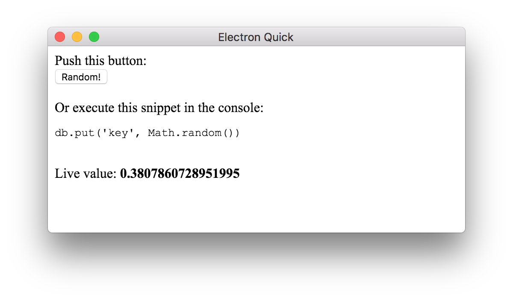

# react-level-value

Live updating [leveldb](https://leveldb.org) value component for [react](https://reactjs.org/)!

## Example

```js
import React from 'react'
import level from 'level'
import { Value } from 'react-level-value'

const db = level('/tmp/react-level-value')

class Example extends React.Component {
  render () {
    return (
      <div>
        Live value: <Value db={db} levelKey="key" />
      </div>
    )
  }
}
```

Now the `<Value />` component will always reflect the value you have stored in your database at `key`.

Find a full example in [/example](example):

```bash
$ npm install
$ npm run rebuild
$ npm start
```



## Installation

```bash
$ npm install react-level-value
```

## API

### `<Value db levelKey />`

## License

MIT
